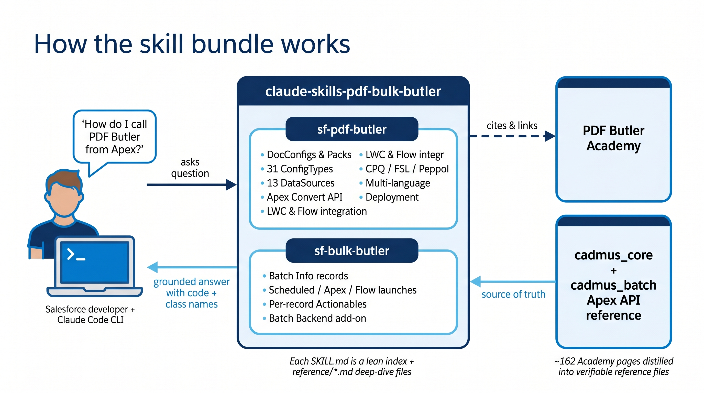

# Claude Code skills for PDF Butler + BULK Butler + SIGN Butler V2

> _**Created by Claude, for Claude.**_ Every reference file in this repo was researched, distilled, and written by Claude from the public CloudCrossing Academies — then wired back into Claude Code as skills so future Claude sessions can answer PDF Butler / BULK Butler / SIGN Butler V2 questions as a grounded specialist instead of guessing.

Three [Claude Code](https://docs.claude.com/en/docs/claude-code) skills that turn Claude into a working specialist on the **PDF Butler**, **BULK Butler**, and **SIGN Butler V2** Salesforce AppExchange packages (by CloudCrossing).



## What's in here

| Skill | Package namespace | Covers |
|---|---|---|
| [`sf-pdf-butler`](./sf-pdf-butler/) | `cadmus_core` | Single-doc generation — DocConfigs, Packs, Actionables, Apex Convert API (all 31 ApexDoc classes), Agentforce-aware `PdfButlerCallable` cross-package dispatch, unit testing with `CadmusHttpCalloutMock`, native `PdfActions` watermarks, `@pdfbutler/migration-cli` (all 10 commands), LWC/Flow integration, every ConfigType + DataSource + Lightning component + Tip/Trick from the [PDF Butler Academy](https://www.pdfbutler.com/academy/pdf-butler-academy/) |
| [`sf-bulk-butler`](./sf-bulk-butler/) | `cadmus_batch` | Bulk generation — Batch Info records with full field list, scheduled/Apex/Flow launches, per-record Run Actionables (Batch Size stays at 5–20, not forced to 1), report-driven batches with full `Reports.ReportManager` code, Batch Backend add-on with `RecordType = "Batch Backend"` + `BatchSize = 100` + merge/zip (`MERGED_PDF` / `ZIP_FILE`) output |
| [`sf-sign-butler`](./sf-sign-butler/) | `cadmus_sign2` | Native e-signature on top of PDF Butler — Sign Request Templates with every verbatim UI field, the `cadmus_sign2.Actionable_SignButlerSilent` / `Actionable_SignButlerSignNow` Pack Actionables, `SIGN_PLACEHOLDER` / `INITIAL_PLACEHOLDER` ConfigType wiring, full 13-token `[[!SignButler.*!]]` merge set, `SignButlerEmails` template folder (35 templates across en/de/es/fr/nl), Reminder / Warning / Expiry batch jobs with cron + OWA / Reply-To strategies, Certificate of Completion (CoC — 7-signer cap), Custom Branding, VisualForce signing alternative |

## Why use these

Without the skill, asking Claude "how do I call PDF Butler from Apex?" gets a generic SOAP/REST guess. With it, Claude knows:

- The exact Apex entry point (`cadmus_core.ConvertController.convertWithWrapper`) with every `ConvertDataModel` field, `webService` vs `global` visibility, and all valid `deliveryOverwrite` values verbatim from the ApexDoc
- That `wrapper.response.base64` is a Blob, not a String, and why your LWC breaks if you don't `EncodingUtil.base64Encode` it
- How to choose between `AbstractBeforeActionable`, `AbstractDataSourceActionable`, `AbstractBeforeWithDataSourcesActionable`, and `AbstractAfterActionable` (and that only the `After` variant receives the `DocGenerationWrapper`)
- The **sanctioned unit-test pattern** — `cadmus_core.CadmusHttpCalloutMock.setTestCalloutMockSuccess(targetId)` so your tests don't hit the real PDF Butler endpoint
- The **cross-package integration pattern** — `PdfButlerCallable` via `System.Callable` `'convert'` for ISV add-ons and **Agentforce custom actions** that can't take a static dependency on `cadmus_core`
- That PDF Butler is **Agentforce-aware** — `MetadataWrapper.USAGE_TYPE.AGENTFORCE` + `CALLED_FROM_TYPE_CUSTOMER.AGENTFORCE` enum values are live
- Native page numbers / title / `DRAFT`/`CONFIDENTIAL`/`SAMPLE` watermarks via `cdm.mergeActions = new PdfActions()` (no more "contact support for `PB_AddPdfMergeActions`")
- Why `Run Async = true` matters for the Flow DOCX→PDF action
- How to set up a new org idempotently (detect-before-install)
- Every one of the 31 ConfigTypes, 13 DataSources, 13 Actionables, 10 Lightning components — with **verbatim Academy labels** (e.g. `Export PDF as PDF/a` not "PDF/A"; `Enable Forms` not "Enable Form Fields")
- All 10 commands of the `@pdfbutler/migration-cli` sf-plugin, both auth modes (org alias + CI-friendly session/instance), every REST endpoint each command hits, verbatim failure-mode table
- CPQ bundle patterns, FSL service reports, Peppol invoicing (with full Apex class list + HTTP status-code mapping), multi-language Alternatives

**Quality commitment**: every class name, method signature, field label, enum value, and CLI flag is quoted verbatim from an official source (ApexDoc, Academy child page, npm README, CLI source). Claims that can't be traced to a source are explicitly labelled "verify in-org" rather than invented. Video-only Academy pages are labelled as such instead of fabricated from the video.

## Install

### Option 1 — symlink (recommended, keeps the skill editable and pullable)

```bash
git clone https://github.com/charliel1981/claude-skills-pdf-bulk-butler.git ~/claude-skills-pdf-bulk-butler
ln -s ~/claude-skills-pdf-bulk-butler/sf-pdf-butler ~/.claude/skills/sf-pdf-butler
ln -s ~/claude-skills-pdf-bulk-butler/sf-bulk-butler ~/.claude/skills/sf-bulk-butler
ln -s ~/claude-skills-pdf-bulk-butler/sf-sign-butler ~/.claude/skills/sf-sign-butler
```

Later, `cd ~/claude-skills-pdf-bulk-butler && git pull` updates all three skills.

### Option 2 — one-shot install script

```bash
git clone https://github.com/charliel1981/claude-skills-pdf-bulk-butler.git /tmp/sfb && /tmp/sfb/install.sh
```

See [`install.sh`](./install.sh) for what it does.

### Option 3 — copy files (for users without Git)

```bash
mkdir -p ~/.claude/skills
cp -R sf-pdf-butler sf-bulk-butler sf-sign-butler ~/.claude/skills/
```

### Verifying the install

Start a Claude Code session and check `/skills` — you should see all three listed. Or ask Claude "what's the cadmus_core Apex entry point?" — if it answers `ConvertController.convertWithWrapper`, the PDF Butler skill is live. Ask "what Actionable class does SIGN Butler V2 use?" — `cadmus_sign2.Actionable_SignButlerSilent` confirms the SIGN Butler skill.

## How it works

Each skill is a folder containing a `SKILL.md` front-matter file (name + description + when-to-trigger guidance) plus optional `reference/*.md` files with deep-dive content. Claude automatically activates a skill when the user's message matches its description, then reads the relevant reference file on demand.

- `sf-pdf-butler/SKILL.md` — lean ~220-line index with post-install checklist and decision tree
- `sf-pdf-butler/reference/*.md` — 11 deep-dive files (~3,200 lines total) covering everything from ConfigTypes to deployment, every PDF Butler ApexDoc class, and full Migration CLI reference
- `sf-bulk-butler/SKILL.md` — ~285-line single file since BULK Butler has a smaller surface

More on Claude Code skills: [code.claude.com/docs/en/skills](https://code.claude.com/docs/en/skills).

## What's NOT in here

- Sibling Butler products — **FORM Butler**, **COLLABORATION Butler**, **CONTRACT Butler**, **AGENT Butler** each have their own Academy and deserve their own skills. PRs welcome, or they'll be added in future versions.
- External PDF reference docs linked from the Academy (`PDF Butler via Invocable v1.pdf`, `APEXActionablesKEYVALUES.pdf`, etc.) — noted as pointers in the skill, not inlined.
- YouTube tutorial transcripts — many Academy pages defer detail to video; these skills capture the written content only.
- Per-tenant credentials / org-specific config — by design.

## ⚠️ Disclaimer — please read before installing

**This is unofficial, AI-generated community content. Use at your own risk.**

- **Not affiliated with CloudCrossing / PDF Butler.** This repo is maintained independently by a Salesforce contractor, not by the vendor. CloudCrossing has not reviewed, endorsed, or vetted this content.
- **AI-written, Claude-distilled.** Every reference file was researched, paraphrased, and structured by Claude (Anthropic's AI) from the public [PDF Butler Academy](https://www.pdfbutler.com/academy/pdf-butler-academy/). AI systems make mistakes. Class names, method signatures, field names, and behavioural guarantees can be wrong, out-of-date, or hallucinated despite best efforts to verify.
- **The Academy is the source of truth, not this skill.** Always cross-check against the official [PDF Butler Academy](https://www.pdfbutler.com/academy/pdf-butler-academy/) and [BULK Butler Academy](https://www.pdfbutler.com/academy/bulk-butler-academy/) before acting on skill-generated advice — especially for production orgs.
- **Content will drift.** PDF Butler and BULK Butler ship new package versions regularly. This skill reflects the Academy as of the date in [CHANGELOG.md](./CHANGELOG.md) and has no auto-update mechanism. Assume anything the skill says may be stale.
- **You are responsible for what you run.** Any code, SOQL, CLI command, deployment step, or permission-set change suggested by Claude while this skill is active is run by you, in your org, at your discretion. **Test in a sandbox first.** The maintainers of this repo accept no responsibility for damage to Salesforce orgs, lost data, licence-limit breaches, security misconfigurations, or operational incidents resulting from use of this skill.
- **No warranty, no support.** This is a community-maintained MIT-licensed artefact. There is no SLA, no support channel, no guarantee of updates, accuracy, or fitness for any purpose. See [LICENSE](./LICENSE) for the full legal disclaimer.
- **Respect CloudCrossing's IP.** Do not use this skill to circumvent PDF Butler's licensing, redistribute their Academy content verbatim at scale, or otherwise infringe on their intellectual property. This skill links back to the Academy throughout precisely so the source of truth stays with the vendor.

If you are from CloudCrossing / PDF Butler and would like changes to attribution, content accuracy, scope, or the repo's existence, please open an issue or contact the maintainer directly — the intent is to help Salesforce developers use your product more effectively, not to replace or compete with the Academy.

## Attribution

This skill distils publicly accessible content from the **[PDF Butler Academy](https://www.pdfbutler.com/academy/pdf-butler-academy/)** and **[BULK Butler Academy](https://www.pdfbutler.com/academy/bulk-butler-academy/)**, published by CloudCrossing / PDF Butler. All product names, class names, and proprietary patterns are trademarks and copyright of their respective owners. This is a community skill intended to help Salesforce developers work with PDF Butler more effectively — not a replacement for the official Academy, which remains the source of truth and is linked throughout.

## License

[MIT](./LICENSE) — applies to the skill wrapper only, not to paraphrased Academy content or to the PDF Butler / BULK Butler products themselves.

## Contributing

See [CONTRIBUTING.md](./CONTRIBUTING.md). TL;DR: PRs welcome for corrections, missing edge cases, or new Butler-product skills. Keep facts verbatim from official sources; don't invent API names.

## Maintainer

Charlie Lang — Salesforce contractor. Open an issue for corrections, or PR directly.

## Cursor
Open this folder in **Cursor Agents Window** (not the .code-workspace file).
Path: `/Users/charlielang/Dropbox/GitHub/claude-skills-pdf-bulk-butler`
